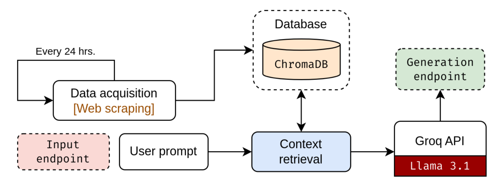

<p align="center">
  
</p>

NewsLLM is a RAG-based LLM application designed to analyze and summarize news articles. It uses [Groq](https://groq.com/) API to generate summaries and insights for different countries and different topics. The application is built using Streamlit and Python.

## How NewsLLM Works

NewsLLM follows a robust workflow to provide accurate and insightful news summaries:

<p align="center">
  
</p>

1. **Data Acquisition**
    - NewsLLM utilizes a custom web scraper (`scraper.py`) to gather news articles from various sources.
    - The scraper targets specific countries and topics.
    - For each topic and country combination, it scrapes up to _10 relevant news articles_ from Google Search results to ensure a diverse range of perspectives are considered.

2. **Database** (ChromaDB)
    - Scraped news articles are processed and stored in a vector database using the `Chroma` library.
    - This database allows for efficient storage and retrieval of news articles based on their semantic similarity.
    - Each article is represented as a vector embedding, capturing its core meaning and context.
    - Database is updated automatically every 24 hours to ensure the information remains current.

3. **Context Retrieval**
    - When a user submits a query (country and topic), NewsLLM retrieves the most relevant articles from the database.
    - User query is transformed into a vector embedding and compared against the embeddings of the stored articles.
    - Top _k=7_ most similar articles are selected as the context for generating the summary and analysis.

4. **Output Generation**
    - NewsLLM utilizes the `Groq` API and uses the `llama-3.1-70b-versatile` model for output generation.
    - Formed context is fed to the LLM, along with carefully constructed prompts designed to elicit a comprehensive summary and analysis.
    - LLM generates a structured response covering key points, trends, context, impacts, controversies, statistical insights, global relevance, and future outlook.
    - Users are also giving the option to continue asking follow-up questions, if desired.


## Installation

1. Clone the repository:
    ```bash
    git clone https://github.com/muhd-umer/news-llm.git
    ```

2. Install dependencies:
    ```bash
    pip install -r requirements.txt
    ```
    
3. Obtain an API key for Groq and store it in a `.env` file as `GROQ_API_KEY="<your_api_key>"`.

## Usage

1. Create initial database as:
    ```bash
    python database.py
    ```
    
2. Run the application using:
    ```bash
    streamlit run app.py
    ```

3. Select a country and topic from the sidebar.
4. Click _"Analyze news"_ to generate a summary and analysis.
5. Ask follow-up questions in the chat interface.

## Tech Stack

- **Streamlit:** For building the user interface.
- **Python:** The primary programming language.
- **Groq API:** For LLM-powered summary and analysis generation.
- **Chroma:** For vector database storage and retrieval.
- **Beautiful Soup:** For web scraping.
- **Google Search:** For finding relevant news articles.
- **LangChain:** For LLM orchestration and prompt management.

## Contributing

Contributions are welcome! Please feel free to open issues and submit pull requests.
